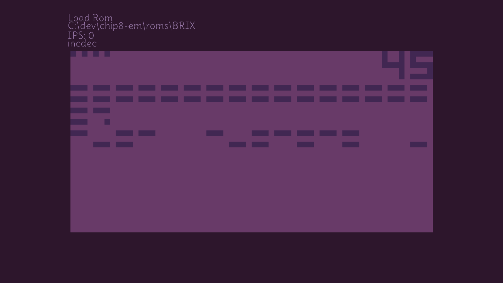

<p>
<h1 align="center">Chip 8 emulator</h2>
<p align="center">C++, OpenGL</p>
<p align="center">

</p>
</p>

## About
Chip-8 emulator. No extentions supported. Only windows supported. Opengl 4.5 required.

Classic chip8 keypad -> desktop keyboard mapping

Ctrl + F : FullScreen

Ctrl + Q : Quit

## Build

Following arguments can be passed
`platform`, `app`, `clean`, `debug`, `release`, `run`, `metacr`

```
./build.bat metacr release platform app
```

Binaries built in `out/`

## Credits

color palette: https://lospec.com/palette-list/velvet-cherry-gb