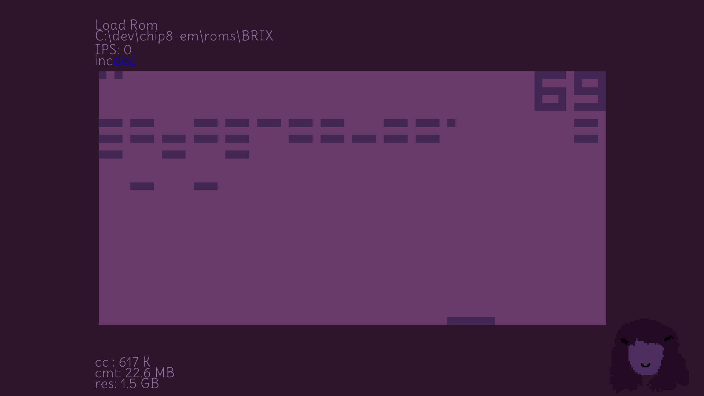

<p>
<h1 align="center">Chip 8 emulator</h2>
<p align="center">C++, OpenGL</p>
<p align="center">

</p>
</p>

## About
Classic Chip-8 emulator.

    keyboard key mapping
    --------------------
    1 2 3 C  -> 1 2 3 4
    4 5 6 D  -> Q W E R
    7 8 9 E  -> A S D F
    A 0 B F  -> Z X C V

Ctrl + F : FullScreen

Ctrl + Q : Quit

You can look at `roms/` for some roms and I got from teh interweb. If you find any roms that run well and were fun, do tell me so I can play them.

I will let you know that chip 8 is known to be wonky for several reasons like unstandardized interpreters, quirks that became "features", etc. So it is possible you find roms that don't run correctly. It is always possible that I made a mistake so feel free to submit PRs.

Also, I don't own a mac or a good linux dev environment (linux debuggers suck), so there might be bugs. In fact, mac version might not even compile. I am hoping sdl handles cross platform stuff, but there might be things I overlooked. I have a suspicion some intrinsics in `base/math.cpp` aren't supported on mac. Feel free to test and lmk. Also, this was my first emulator. Before this I made a crap fantasy cpu because any real assembly is far too complex for me to reason about.

cheers

## Build

### Windows

OpenGL backend is used by default. To change, look for a macro in main.cpp

Following arguments can be passed
`platform`, `app`, `clean`, `debug`, `release`, `run`, `metacr`

```
./build.bat release metacr platform app
```

### Linux / Mac

SDL renderer is only supported.

This requires sdl3. You need to build it from source. Incase you need help, this is how I did it,
```
git clone https://github.com/libsdl-org/SDL.git
cd SDL
mkdir build
cmake -S ~/deps/SDL -B ~/deps/SDL/build
cmake --build ~/deps/SDL/build
sudo cmake --install ~/deps/SDL/build --prefix /usr/local
sudo ldconfig
```

Now, building the emulator.

Following arguments can be passed
`clang`, `gcc`, `platform`, `app`, `clean`, `debug`, `release`, `run`, `metacr`

```
./build.sh clang release metacr platform app
```

Binaries built in `out/`

Incase you get an error saying display device not found, try downloading the libraries from [SDL GitHub page](https://github.com/libsdl-org/SDL/blob/main/docs/README-linux.md)

And rebuild SDL


## Contributing

Follow style guide and open pr. Maybe supporting extentions would be fun. Ofc, if you find bugs, etc., feel free to report them.

## Credits

SDL: https://github.com/libsdl-org/SDL 

color palette: https://lospec.com/palette-list/velvet-cherry-gb

Font (Delius) : https://www.dafont.com/font-comment.php?file=delius
